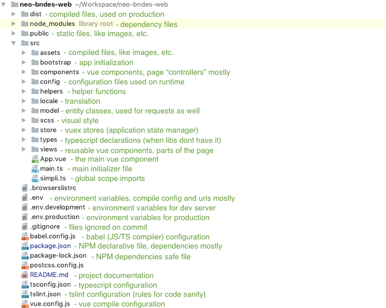

# NEO BNDES Web
This is a sample project of Smart Contract interaction using neon-js.
It uses javascript (node-forge) to create a signature from a x509 certificate.

Operations supported by the browser (javascript):
- Create/Import NEO account;
- Create/Open Wallet;
- Usage charts (using offchain API provided by the indexer)
- Smart Contract Interaction;
- Signing a payload using a x509 certificate (in our example, we use e-cpf - a brazilian document)

Related projects:
- [Notification indexer](https://github.com/simplitech/neo-nep-utxo-indexer)
- [Smart Contract example)(https://github.com/simplitech/neo-sc-bndes-example)

## Project setup

### Install Dependencies
```sh
npm i
```

### Run on development mode
```sh
npm run serve
```

### Build for production
```sh
npm run build
```

## Project Dependencies

### Logic and processing
- `@cityofzion/neon-js` - Javascript libraries that allow the applications to interact with NEO blockchain
- `node-forge` - cryptography tools

### Frontend and rendering utilities
- `chart.js` - Charts using the `<canvas>`
- `chartkick` - Chartjs utility to create charts with one line
- `font-awesome` - iconic SVG, font, and CSS toolkit
- `linelay` - A CSS port of LinearLayout. Multidirectional grid that saves more space for mobile devices.
- `normalize-scss` - a collection of HTML element and attribute rulesets to normalize styles across all browsers
- `simple-line-icons` - Simple and Minimal Line Icons
- `simpli-web-sdk` - Simpli's SDK with a lot of utilities to work with Vue
- `vue` - framework for building UI
- `vue-chartjs` - chartjs for vue
- `vue-chartkick` - chartkick for vue
- `vue-meta` - Manage page meta info
- `vue-moment` - Handy Moment.js filters for your Vue
- `vue-property-decorator` - Decorators for Vue classes
- `vue-spinner` - Loading spinners
- `vuex` - Centralized State Management
- `vuex-class` - Binding helpers for vuex

## Project file structure



## FAQ

### How to read a p12 file and associate the user signature with a NEO account?
Check `PersistRegularAccountView.vue` file

### How to make requests to NEO blockchain?
Check `neo.helper.ts` file and `model` folder

### How account selectionworks?
Check `AccountSelector.vue` and `auth.ts`

